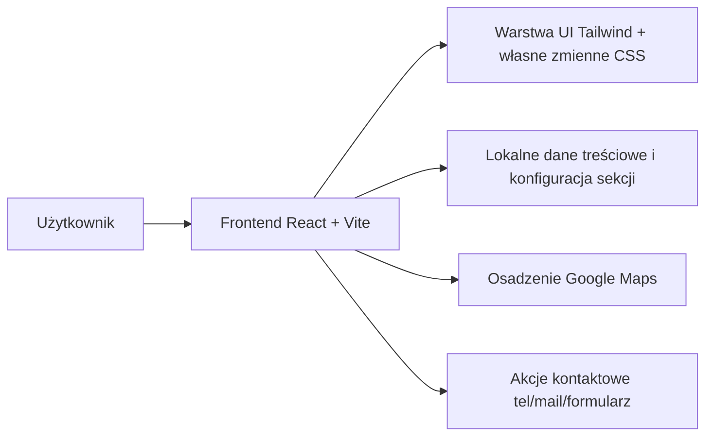

## 1. Projekt Architektury


## 2. Opis Technologii
- Frontend: React 18 + TypeScript + Vite
- Stylowanie: Tailwind CSS 3 + własne zmienne CSS w warstwie globalnej
- Animacje: CSS animations + Intersection Observer do reveal-on-scroll i lekkiego parallax
- Ikony: `lucide-react`
- Osadzona mapa: Google Maps poprzez responsywny `iframe`
- Zarządzanie treścią: statyczne dane w plikach TypeScript dla prostoty utrzymania

## 3. Definicje Tras
| Trasa | Cel |
|-------|-----|
| / | Jednostronicowy landing premium z pełną prezentacją obiektu i sekcji rezerwacji |

## 4. Definicje API
Brak dedykowanego backendu w pierwszej wersji. Formularz działa jako front-endowy formularz kontaktowy z przygotowaniem do późniejszej integracji z zewnętrznym endpointem, usługą mailową lub CRM.

```ts
type BookingFormData = {
  fullName: string;
  phone: string;
  email: string;
  arrivalDate: string;
  departureDate: string;
  guests: string;
  message: string;
};
```

## 5. Model Danych
### 5.1 Definicje Modeli Widoku
```ts
type NavItem = {
  label: string;
  href: string;
};

type ValueProp = {
  title: string;
  description: string;
  icon: string;
};

type RoomCard = {
  name: string;
  area: string;
  image: string;
  amenities: string[];
};

type OfferCard = {
  title: string;
  subtitle: string;
  details: string;
};

type ReviewCard = {
  author: string;
  quote: string;
};

type FaqItem = {
  question: string;
  answer: string;
};
```

## 6. Struktura Aplikacji
- `src/main.tsx`: bootstrap aplikacji
- `src/App.tsx`: kompozycja sekcji strony
- `src/components/`: sekcje i komponenty wielokrotnego użytku
- `src/data/site-content.ts`: treści i dane konfiguracyjne
- `src/styles/`: warstwa globalna, zmienne CSS, utility dla efektów tła i animacji

## 7. Założenia Implementacyjne
- Aplikacja pozostaje lekka i szybka: bez zbędnych bibliotek sliderowych i ciężkich frameworków animacji.
- Estetyka jest osiągana przez dopracowaną typografię, spacing, warstwowe tła, selektywne animacje i wysokiej jakości obrazy.
- Wszystkie sekcje budowane semantycznie: `header`, `main`, `section`, `article`, `footer`, formularz z poprawnym labelowaniem.
- Kontrast, focus states i `prefers-reduced-motion` są uwzględnione od początku.
- Finalna implementacja wymaga potwierdzenia docelowego adresu e-mail kontaktowego lub oznaczenia go jako tymczasowy placeholder.
