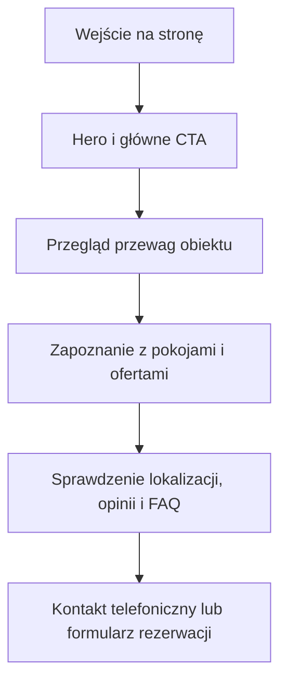

## 1. Przegląd Produktu
Jednostronicowa, w pełni responsywna strona premium dla obiektu wypoczynkowego "Domek na Zrąbku Pod Gubałówką", zaprojektowana w estetyce modern alpine luxury z naciskiem na wysoki poziom zaufania i konwersję rezerwacji.
- Główny cel: elegancko zaprezentować obiekt, jego przewagi, pokoje, lokalizację i opinie oraz kierować użytkownika do kontaktu telefonicznego lub formularza rezerwacji.
- Wartość biznesowa: wyróżnienie obiektu na tle generycznych stron noclegowych i zwiększenie liczby zapytań dzięki dopracowanemu premium UX.

## 2. Kluczowe Funkcje

### 2.1 Moduły Funkcjonalne
1. **Strona główna**: nawigacja, hero, przewagi, sekcja o obiekcie, pokoje/domki, oferty specjalne, lokalizacja, opinie, FAQ, kontakt i stopka.
2. **Nawigacja kotwicowa**: płynne przejścia do sekcji, widoczny przycisk rezerwacji oraz szybki dostęp do danych kontaktowych.
3. **Formularz kontaktowo-rezerwacyjny**: podstawowe pola kontaktowe, zakres pobytu, liczba gości i wiadomość.

### 2.2 Szczegóły Strony
| Nazwa strony | Nazwa modułu | Opis funkcjonalny |
|--------------|--------------|-------------------|
| Strona główna | Navbar | Pływająca kapsuła z półprzezroczystym tłem, linkami do sekcji i wyróżnionym CTA "Rezerwacja". |
| Strona główna | Hero | Duży, niemal pełnoekranowy blok z górskim zdjęciem, subtelnym overlayem, mocnym nagłówkiem i przyciskiem prowadzącym do kontaktu. |
| Strona główna | Przewagi | 4 karty z ikonami i krótkimi komunikatami: lokalizacja, cisza, wyposażenie, parking. |
| Strona główna | O obiekcie | Asymetryczna sekcja łącząca obraz, treść premium i atmosferę pobytu blisko natury. |
| Strona główna | Pokoje / Domki | Kafelki sprzedażowe z nazwą, metrażem, zdjęciem, listą udogodnień i CTA dostępności. |
| Strona główna | Oferty specjalne | Minimalistyczne karty ofert z dyskretnym akcentem sezonowym i przyciskiem kontaktowym. |
| Strona główna | Lokalizacja | Sekcja z mapą Google embed, adresem oraz badge'ami opisującymi przewagi położenia. |
| Strona główna | Opinie | Sekcja social proof z oceną 4,9/5 i trzema cytatami gości. |
| Strona główna | FAQ | Akordeon z podstawowymi pytaniami dotyczącymi pobytu i wyposażenia. |
| Strona główna | Kontakt / Rezerwacja | Ciemna sekcja z formularzem, numerem telefonu i miejscem na potwierdzony adres e-mail. |
| Strona główna | Stopka | Dane kontaktowe, skróty nawigacyjne i linki social media w spójnym, ciemnym stylu. |

## 3. Główny Proces
Użytkownik trafia na hero, rozumie charakter obiektu w pierwszych sekundach, przewija do sekcji przewag i pokoi, następnie sprawdza lokalizację, opinie i FAQ, po czym przechodzi do formularza lub kontaktu telefonicznego.

## 4. Projekt Interfejsu
### 4.1 Styl Projektowy
- Kolory główne: ciepły off-white, kremowy beż, taupe, głęboki orzechowy brąz oraz bursztynowo-złoty akcent.
- Styl przycisków: kapsułowe, eleganckie, z delikatnym uniesieniem i miękkim cieniem na hover.
- Typografia: wyrazisty, szlachetny font display dla nagłówków oraz nowoczesny, premium grotesk dla tekstu głównego.
- Układ: desktop-first, asymetryczny editorial layout, duże światło między sekcjami, wyraźne rytmy pionowe.
- Ikony i detale: cienkie ikony liniowe, subtelne patterny inspirowane podhalańską geometrią, delikatny grain/noise.

### 4.2 Przegląd Wizualny Sekcji
| Nazwa strony | Nazwa modułu | Elementy UI |
|--------------|--------------|-------------|
| Strona główna | Navbar | Glassmorphism, blur, cienki border, kapsułowy układ, highlight CTA. |
| Strona główna | Hero | Tło z górskim krajobrazem, overlay, parallax, szeroki tracking, staggered reveal. |
| Strona główna | Przewagi | Jasne karty z ciepłym cieniem, ikonami i delikatnym gradientem powierzchni. |
| Strona główna | O obiekcie | Duże zdjęcie z dużym radius, tekst w dwóch blokach, akcentowy detal liczbowy lub etykieta. |
| Strona główna | Pokoje / Domki | Duże kafelki, wyraźne fotografie, pill-badge z metrażem i ikonograficzna lista udogodnień. |
| Strona główna | Oferty specjalne | 3 eleganckie karty z subtelnym akcentem sezonowym zamiast agresywnych promocji. |
| Strona główna | Lokalizacja | Duży embed mapy, badge'e informacyjne, dane adresowe i czas do ważnych punktów. |
| Strona główna | Opinie | Karty z cytatem, nazwą gościa i krótką oceną budującą wiarygodność. |
| Strona główna | FAQ | Akordeon o spokojnych animacjach, cienkich borderach i czytelnym kontraście. |
| Strona główna | Kontakt / Rezerwacja | Ciemne tło o fakturze drewna, butikowy formularz, czytelne etykiety i focus ring. |
| Strona główna | Stopka | Minimalistyczna kontynuacja dark section z prostą strukturą i bez technicznego chaosu. |

### 4.3 Responsywność
- Podejście desktop-first z pełnym dopracowaniem wersji mobilnej i tabletowej.
- Sekcje zachowują duże odstępy i hierarchię także na mniejszych ekranach, ale z uproszczeniem kompozycji do jednego strumienia.
- Nawigacja mobilna korzysta z lekkiego drawer/menu z zachowaniem premium estetyki.
- Interakcje dotykowe: duże hit-area, czytelne focus states i ograniczenie nadmiaru ruchu dla urządzeń mobilnych.

## 5. Dane Treściowe
- Nazwa: Domek na Zrąbku Pod Gubałówką
- Adres: Nowe Bystre 201B, 34-521 Ząb
- Telefon: 696 253 669
- Opinie: 4,9/5 na podstawie 27 opinii w Google
- Adres e-mail: do potwierdzenia przed wdrożeniem treści finalnej
